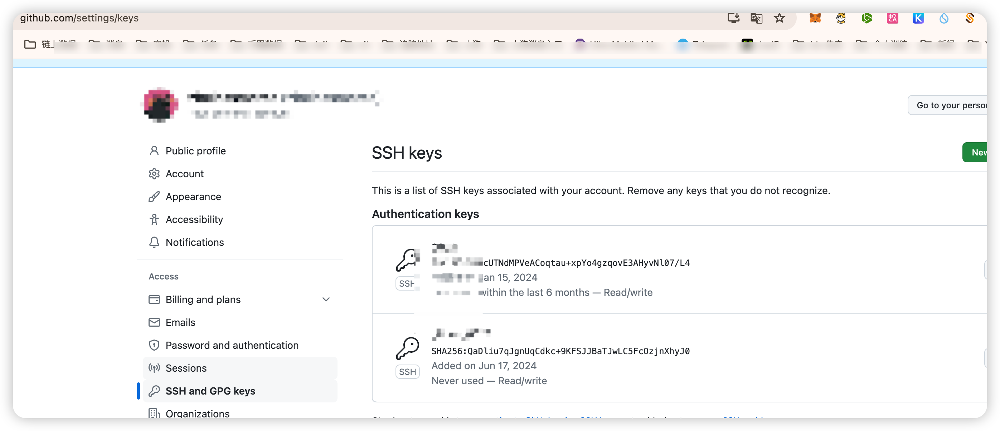

1. git clone https:
2. 建立 feature branch  ///  git checkout -b my-feature   我的当前分支。
3. 修改代码，在本地，
4. git diff   查看我的修改的那些。
5. git add   <changed_file>   把文件放在一个叫做git  暂存区的地方
6. git commit  把文件真的放在git 中【  这个步骤，git  main  my-feature 有两个主支，是不一样的，
7. git push origin my-feature    提交给github  
8. 你的github  仓库，多出了一个分支，叫做，my-feature 
9. 如果github 代码，被修改了，或者你不知道修改没有修改，你就需要，下面的步骤
10. git  checkout main   ]  更新我的main  主支
11. git pull origin master  ,  远端的main  同步到 git  mian  .
12. git checkout my-feature   
13. git rebase main  把我的修改先放到一边，把main  的代码拿过来。这一步，就是在最新的main  分支上做修改。|【【rebase conflict  有冲突，你需要选择
14. git push -f origin my-feature  [ 强行pull 代码== force ]
15. new pull request 
16. Squash and merge   把这个分支上的所有改变，变成一个
17. 删除my-feature 
18. git checkout main 
19. git branch -D my-feature
20. git pull origin master
21. 
22. 
23. fd
24. d
25. d
26. git pull 



好的，我们可以生成一个新的SSH密钥，并将其添加到GitHub账户中，以便所有仓库都可以使用这个新密钥。

### 生成新的SSH密钥

1. 打开终端，并生成新的SSH密钥：
    ```sh
    ssh-keygen -t rsa -b 4096 -C "your_email@example.com"
    ```
    按提示操作，通常可以直接按回车使用默认路径和文件名（例如：`~/.ssh/id_rsa_new`）。你可以为密钥文件指定一个新的名称，例如 `~/.ssh/id_github`，以避免与现有密钥冲突。

    ```sh
    Enter file in which to save the key (/Users/zhao/.ssh/id_rsa): /Users/zhao/.ssh/id_github
    ```

2. 当提示输入密码时，你可以选择设置一个密码，也可以直接按回车不设置密码。

### 添加新的SSH公钥到GitHub

1. 查看新生成的SSH公钥：
    ```sh
    cat ~/.ssh/id_github.pub
    ```
2. 复制输出内容。

3. 打开[GitHub SSH设置页面](https://github.com/settings/keys)，点击“New SSH key”，粘贴公钥并保存。

### 配置SSH客户端

1. 编辑SSH配置文件：
    ```sh
    nano ~/.ssh/config
    ```

2. 添加以下内容：
    ```sh
    Host github.com
      HostName github.com
      User git
      IdentityFile ~/.ssh/id_github
    ```

3. 保存并关闭文件（在nano中，按 `Ctrl+X`，然后按 `Y` 并按 `Enter`）。

### 添加新的SSH密钥到代理

1. 确保SSH代理正在运行，并添加新的SSH密钥：
    ```sh
    eval "$(ssh-agent -s)"
    ssh-add ~/.ssh/id_github
    ```

### 测试新的SSH连接

1. 测试是否能通过新的SSH密钥连接到GitHub：
    ```sh
    ssh -T git@github.com
    ```

    你应该看到类似以下的输出：
    ```sh
    Hi username! You've successfully authenticated, but GitHub does not provide shell access.
    ```

### 推送到远程仓库

1. 确认远程仓库配置正确，然后再次尝试推送操作：
    ```sh
    git remote add origin git@github.com:zhclassmates/Cryptostudy.git
    git push -u origin main
    ```

### 完整操作步骤总结

1. **生成新的SSH密钥**：
    ```sh
    ssh-keygen -t rsa -b 4096 -C "your_email@example.com"
    ```
    如果指定文件名为 `id_github`：
    ```sh
    Enter file in which to save the key (/Users/zhao/.ssh/id_rsa): /Users/zhao/.ssh/id_github
    ```

2. **添加新的SSH公钥到GitHub**：
    ```sh
    cat ~/.ssh/id_github.pub
    ```
    复制输出内容并添加到[GitHub SSH设置页面](https://github.com/settings/keys)。

3. **编辑SSH配置文件**：
    ```sh
    nano ~/.ssh/config
    ```
    添加以下内容：
    ```sh
    Host github.com
      HostName github.com
      User git
      IdentityFile ~/.ssh/id_github
    ```

4. **启动SSH代理并添加新的SSH密钥**：
    ```sh
    eval "$(ssh-agent -s)"
    ssh-add ~/.ssh/id_github
    ```

5. **测试SSH连接**：
    ```sh
    ssh -T git@github.com
    ```

6. **配置远程仓库并推送代码**：
    ```sh
    git remote add origin git@github.com:zhclassmates/Cryptostudy.git
    git push -u origin main
    ```

这样，新的SSH密钥就可以用于所有的GitHub仓库了。